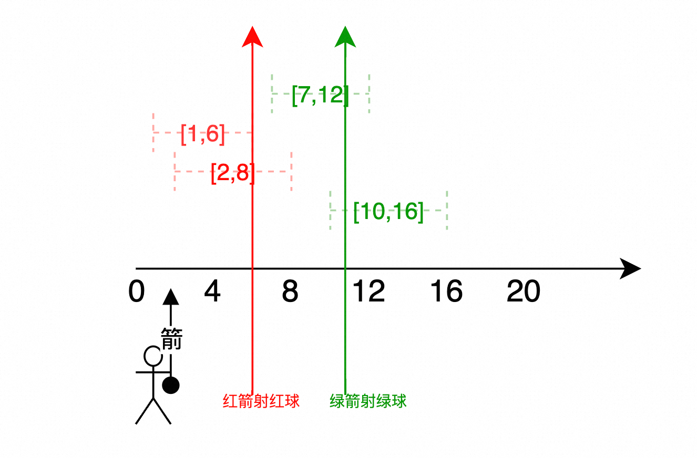

# 贪心算法
## 理论基础
找到每个阶段的局部最优解，再组合成全局最优解。  
### 贪心的套路
贪心无套路，没办法套用通用的套路。  
要想清楚局部最优解，再考虑局部最优解能否构成全局最优解。  

## 算法
### 1. 分发饼干
力扣地址： https://leetcode.cn/problems/assign-cookies/description/  
项目代码： DSendCake.class  
核心代码：   
``` java.
        // g 胃口数组，s 饼干数组
        Arrays.sort(g);
        Arrays.sort(s);
        int result = 0;
        int index = s.length - 1;
        for(int i = g.length -1; i>=0; i--){
            if (index >= 0 && s[index] >= g[i]){
                index --;
                result ++;
            }
        }
        return result;
```
算法思路：  
尽量用大饼干去喂胃口大大孩子，充分利用规格大的饼干  
局部最优： 每次找到最大饼干尽量去找能满足的最大胃口的孩子。  
全局最优： 局部最优可以推出。  
具体实现：  
- 小孩胃口、饼干尺寸数组排序（从小到大）
- 维护result 来记录满足的数据，index来记录当前饼干尺寸数组位置
- 遍历小孩胃口数组，倒序遍历。if 来判断饼干是否能满足胃口（条件：当前饼干尺寸大于等于小孩胃口。这里我们反序遍历孩子胃口数组，符合饼干 >= 孩子胃口的情况 result++ 且移动饼干数组。
- 如果满足了 饼干数组左移，小孩胃口数组左移。  
  
### 2. 摆动序列
力扣地址： https://leetcode.cn/problems/wiggle-subsequence/description/  
项目代码： DWiggleSequence.class. 
核心代码：  

```java.
        if(nums.length <=1){
            return nums.length;
        }
        int prediff = 0, currdiff = 0, result = 1;
        // 注意这个循环从1开始，目的是计算nums[0]的prediff和currdiff，那么对于最后一个元素我们不必计算默认result初始值为1就是这个波峰。
        for(int i = 1; i < nums.length; i++){
            currdiff = nums[i] - nums[i -1];
            if( (prediff >= 0 && currdiff < 0) ||  (prediff <=0 && currdiff >0)){
                result ++;
                prediff = currdiff;
            }
        }
        return result;
```
算法思想：
- 注意并不是求一个最长的子序列，而是删除元素后满足摆动序列的序列长度。
- 如何判断摆动？ 对于元素i，如果 元素i-1 和 i 的差值为负，i和元素i+1的差值为正，那么i就称为摆动点，反之亦然。
- 产生波峰点条件 ，我们将左侧差值记为 preDiff 右侧差值记为 currDiff。
- 情况说明：
    - 首位元素，首位元素默认天然波峰，对于首元素，我们初始化preDiff = 0 那么无论下一个元素比首元素大还是小都会记为一次波峰，对于尾部元素我们记result 初始值为1可以跳过考虑。
    - 正常情况 1-2-1、2-1-2 对于元素2来说第一种情况 preDiff > 0,currDiff < 0。 第二种情况 preDiff < 0, currDiff > 0
    - 上下坡有平坡的情况 1-2-2-2-1，我们只记录最后一次2为一次波峰。
    - 单调有中有平坡的情况 1-2-2-3-4 对于元素 3 我们不应该记为平坡，在代码中体现在preDiff 不应该随 currDiff变化，应该在记录波峰后再更新。
    代码实现：
- 首先特殊情况判空
- 初始化 preDiff、currDiff、result
- 遍历数组注意 我们遍历到 i 其实是对 i-1位置对元素进行preDiff 与 currDiff的计算
- 遍历到当前元素时，我们进行波峰的判断，即左右异号，注意对于preDiff 可以取等于0的情况 表示当前时平坡状态。
- 当满足波峰条件时 我们需要result ++ 并且更新preDiff 就是当前的currDiff。  

### 3. 最大子序列和
力扣地址： https://leetcode.cn/problems/assign-cookies/description/  
项目代码： DSendCake.class  
核心代码：
``` java.
        int pre = 0;
        int maxAns = nums[0];
        for(int x : nums){
            pre = Math.max(pre + x,x);
            maxAns = Math.max(maxAns,pre);
        }
        return maxAns;
```
算法思路：  
- 可以有两种解法：一种前缀和思想，一种贪心算法思想。
- 前缀和思想：维护一个pre ，循环遍历数组更新pre pre = Math.max(pre + nums[i], nums[i]) 如果前缀和 + 当前值 大于 当前值，说明前缀和为正 那么保留，反之则舍去前缀和，从当前位置开始重新计算。维护result 存储最大结果。
- 贪心思想：这里的贪心也就是前缀和思想，总而言之是 如果前缀和为负数 那么我们丢弃不要，为正则我们保留。  

具体实现：
- 初始化 pre = 0，result = Integer.MIN_VALUE;
- 遍历数组，更新前缀和，更新result记录最大值。  

### 4. 买卖股票的最佳时机 2 可以在区间内多次买入卖出。
力扣地址： https://leetcode.cn/problems/best-time-to-buy-and-sell-stock-ii/description/  
项目代码： DBestTimeToBuyAndSellStock.class  
核心代码：
``` java.
        int maxProfit = 0;
        for(int i = 1; i < prices.length; i++){
            int profit = prices[i] - prices[i-1];
            if(profit > 0){
                maxProfit += profit;
            }
        }
        return maxProfit;
```
算法思路：
- 一段内时间的多次买卖股票最大利润问题等于每天都买卖股票，每天都会产生利润，只需要记录正的利润即可，亏损就当没买。  

具体实现：
- 维护最大利润，遍历数组从第二天开始，计算当天利润，如果为正则加入利润数组。  

### 5. 跳跃游戏
力扣地址： https://leetcode.cn/problems/jump-game/description/  
项目代码： JumpGame.class  
核心代码：
``` java.
        int cover = 0;
        if(nums.length ==1){return true;}
        for(int i =0;i<= cover;i++){
            cover = Math.max(cover, i + nums[i]);
            if(cover >= nums.length -1){
                return true;
            }
        }
        return false;
```
算法思路：
- 一定要注意，题目说的一次可以跳多次，属于误导，我们只关注覆盖范围（能跳的步数就是他的覆盖范围）。如果能覆盖到最后一个元素那么我们认为可以完成返回true，否则返回false。
- 贪心算法思想：围绕最大覆盖范围进行遍历，每次都更新最大覆盖范围，添加判断如果当前覆盖范围大于数组最后一个元素位置，那么返回true结束循环。
  

具体实现：
- 维护最大覆盖范围cover ，遍历数组，终止条件为当前遍历元素小于等于最大覆盖范围。
- 循环中更新最大覆盖范围， 当前覆盖范围 与 i + nums[i]取最大值。
- 循环中添加判断，如果覆盖范围已经能够达到最后一个元素了 那么跳出循环。
- 循环结束如果还没有达到覆盖条件说明不能覆盖，返回false;

### 6. 跳跃游戏二
力扣地址： https://leetcode.cn/problems/jump-game-ii/description/
项目代码： JumpGameTow.class  
核心代码：
``` java.
        int result = 0; // 存储步数
        int corver = 0; // 存储当前最大覆盖范围
        int nextCover = 0; //存储下一步最大覆盖范围
        for(int i =0;i< nums.length;i++){
            nextCover = Math.max(nextCover, i + nums[i]);
            if(i == corver){
                result ++;
                corver = nextCover;
            }
        }
        return result;
```
算法思路：
- 不要去考虑每次应该跳跃几步，还是从覆盖范围的角度进行考虑。
- 我们遍历数组，维护每一个元素的最大覆盖范围，同时使用一个变量表示当前的覆盖范围。
- 当当前遍历位置到达当前覆盖范围时，我们步数++，同时更新最大覆盖范围，直至数组末尾。   
具体实现：
- 初始化变量，result 结果 corver 当前覆盖范围 nextCover 下一步最大覆盖范围
- 遍历数组，终止条件为到达数组末尾
- 对于每一个元素都与下一步最大覆盖范围进行比较。
- 进行判断 如果当前位置到达了覆盖范围，那么我们就使用下一步最大覆盖范围替换当前覆盖范围，同时步数加一表示进行一次跳跃
- 这里的误区是不必关注在哪里进行跳跃，只关注与覆盖范围。如当前遍历位置为i，当前覆盖范围已经等于i了，那么我们进行更新，跳跃的位置就是nextCover - nums[nextCover的位置]； 

### 7. n次取反后最大化的数组和
力扣地址： https://leetcode.cn/problems/maximize-sum-of-array-after-k-negations  
项目代码： DMaximizeSumOfArrayAfterKNegations.class  
核心代码：
``` java.
        Arrays.sort(nums);
        for(int i =0;i<nums.length && k > 0;i++){
            if(nums[i] < 0){
                nums[i] = -nums[i];
                k --;
            }
        }
        if(k % 2 == 1){
            Arrays.sort(nums);
            nums[0] = - nums[0];
        }
        int sumResult = 0;
        for(int num : nums){
            sumResult += num;
        }
        return sumResult;
```
算法思路：
- 使用贪心的思想，首先先将所有负的元素反转为正
- 如果k还有剩余，那么我们将最小的元素反转，注意无论k剩余多少个只需要k%2 == 1时进行翻转一次即可。  

具体实现：
- 数组排序
- 反转负数
- 数组第二次排序
- k如果剩余且%2 == 1，则翻转数组的最小元素
- 求和。

### 8. 加油站
力扣地址： https://leetcode.cn/problems/gas-station/description/  
项目代码： DGasStation.class  
核心代码：
``` java.
        // 维护油差数组
        int n = gas.length;
        int[] gasDiff = new int[n];
        int diffSum = 0;
        for(int i =0;i<len ;i++){
            gasDiff[i] = gas[i] - cost[i];
            diffSum += gasDiff[i];
        }
        if(diffSum < 0)return -1; // 油差之和小于0，从哪出发都无法环绕一圈

        // 贪心，目的不是模拟循环，而是排除不可能的点
        // 如 循环到 i = 3，此时 totalGass < 0 那么表示从start 到 i 中任意一点出发，都不能到达（环绕一圈），所以更新start = start + 1;
        int start = 0; // 开始位置
        int totalGas = 0; // 邮箱油量
        for(int i = 0;i < len; i++){
            totalGas += gasDiff[i];
            if( totalGas < 0){
                start = i+1;
                totalGas = 0;
            }
        }
        return start;
```
算法思路：  
- 暴力解法：
  - 用一个for循环模拟从gas数组，出发。在嵌套一个循环来模拟汽车进行路径循环。 时间复杂度n^2。 注意代码实现中用while模拟转圈。
- 贪心算法：
  - 首先计算油差数组，数组和。如果油差数组和小于0那么一定没办法到达。如果不为0则一定能够到达，请记住这一点！
  - 然后遍历数组，维护一个当前油量和start表示出发位置（初始为0）。
  - 如果当前油量和小于0表示从start 到 i 的位置一定无法到达，更新start 为 i+1。
  - 遍历结束后start 就是从start出发可以绕路线一周的位置。
  
### 9. 分发糖果
力扣地址： https://leetcode.cn/problems/candy/description/  
项目代码： DSendCandy.class  
核心代码：
``` java.
        int n = ratings.length;
        int[] candy = new int[n];
        candy[0] = 1;
        // 从前往后 i 从1开始到n -1
        for(int i = 1; i < n; i++){
            if(ratings[i] > ratings[i - 1]){
                candy[i] = candy[i -1] + 1;
            }else{
                candy[i] = 1;
            }
        }
        // 从后往前 i从 n -2 到 0
        for(int i = n -2 ; i >=0; i--){
            if(ratings[i] > ratings[i + 1]){
                candy[i] = Math.max(candy[i + 1] + 1, candy[i]);
            }
        }
        // 求和
        int result = 0;
        for(int i : candy){
            result += i;
        }
        return result;
```
算法思路：
- 分发糖果问题，题目要求每个孩子至少一个糖果，相邻的两个孩子中，得分较大的会获得更多的糖果。
- 我们可以两次遍历，第一次从前往后比较 i-1 和i，如果i的得分大那么i就获得 i-1孩子的糖果 +1，否则获得1个初始糖果。
- 第二次遍历从后往前，且从 len - 2 的位置开始，比较 i 和 i + 1，如果i得分大那么我们获得 i 位置原来的糖果数量与 i + 1 位置 + 1 的糖果数量的较大值。
- 最后一步求和。  


### 10. 柠檬水找零
力扣地址： https://leetcode.cn/problems/lemonade-change/description/  
项目代码： DSendCake.class  
核心代码：
``` java.
        int five = 0;
        int ten = 0;
        switch(bills)...
```
算法思路：  
- 维护五元、十元钞票的个数，遍历账单，用switch来控制收到的钱，可能为5、10、20元
- 五元
  - 直接five ++
- 十元
  - 如果five 的个数大于0表示可以找零，那么 five -- 且 ten ++
- 二十元
  - 利用贪心思想，尽可能的保证5元的数量多，首先判断能否用 5 + 10 组合找开，如果不行再用 三个 5 找零，都不行则返回false

### 11. 根据身高重建队列
力扣地址： https://leetcode.cn/problems/queue-reconstruction-by-height/description/  
项目代码： DRebuildingQueueByHeight.class  
核心代码：
``` java.
        // 首先按身高，从大到小排序
        Arrays.sort(people, (a,b) ->{
            if(a[0] == b [0]){
                return a[1] - b[1];
            }
            return b[0] - a[0];
        });

        // 然后将k较小的移动到前面
        LinkedList<int[]> list = new LinkedList<>();
        for(int[] p : people){
            list.add(p[1], p);
        }
        return list.toArray(new int[people.length][]);
```
算法思路：  
- 对于people数组 people[i] = {hi,ki}, hi表示身高，ki表示 i的前面有k个元素
- 首先我们对people数组进行排序，这里需要重写排序方法，身高从大到小排列，对于身高相同的情况，我们将k值较小的元素放在前面。
- 然后初始化一个链表，由于后续需要不断调整位置，链表节省了调整的时间。
- 遍历people数组，将元素插入 调用linkedlist.add(int index, T element)方法，插入people[i]到 k 的位置。
- 返回结果链表，linkedlist -> int[][]  需要 list.toArray(new int[长度][]);
具体实现：

### 12. 用最少的箭引爆气球
力扣地址： https://leetcode.cn/problems/minimum-number-of-arrows-to-burst-balloons/description/  
项目代码： DMinimunArrowsToBurst.class  
题目解释： 
核心代码：
``` java.
        // 第一步，先对左边界排序 从小到大
        int n = points.length;
        if(n == 0) return 0;
        Arrays.sort(points, (a,b) ->{
            return Integer.compare(a[0], b[0]);
        });
        // 第二步 遍历结合逻辑判断
        int arrows = 1; // 最少需要1根箭
        int miniRight = points[0][1]; // 处理区间最小右边界
        for(int i = 1; i < n; i++){
            // 当前节点 左边界大于区间右边界时，需要添加一只箭
            if(points[i][0] > miniRight){
                arrows++;
                miniRight = points[i][1];
            }else {
                // 当前节点左边界不大于区间右边界，那么我们更新最小右边界。遍历下一个节点。
                miniRight = Math.min(miniRight, points[i][1]);
            }
        }
        return arrows;
```
算法思路：  
- 对于气球数组 points[i] = {left,right}。我们首先对left 左边界进行从小到大排序，这里要重写Arrays.sort 并使用Integer.compare(a,b)的方法防止越界。
- 第二步开始计算需要多少只箭，首先判断气球数组，如果为0则直接返回0，接着初始化 箭arrows = 1，维护一个右边界 miniRight来一直保持为当前处理阶段最小右边界。
- 循环遍历
  - 情况一：当前节点的左节点严格大于处理区间最小右边界miniRight，我们添加一只箭，同时更新miniRight为当前节点的右节点。
  - 情况二：上述的else情况，说明区间还可以再继续扩大，更新miniRight为当前节点与miniRight的较小值。
- 最后返回arrows即可。

### 13. 无重叠区间
力扣地址： https://leetcode.cn/problems/non-overlapping-intervals/description/  
项目代码： DNoOverlapping.class  
核心代码：
``` java.
        Arrays.sort(intervals,(a, b) -> {
            return Integer.compare(a[0], b[0]);
        });
        int n = intervals.length;
        if(n == 0)return 0;
        int count = 0;
        int miniRight = intervals[0][1];
        for(int i = 1; i < n;i++){
            if(intervals[i][0] > miniRight){
                count++;
                miniRight = intervals[i][1];
            }else {
                miniRight = Math.min(miniRight, intervals[i][1]);
            }
        }
        return count;
```
算法思路：  
- 本题类比上一题用最少的箭引爆气球，都是求区间最小重叠问题,我们可以看成是求有多少个重叠的区间。
- 还是一样先左边界排序，维护count、维护最小右边界。需要注意的是 count是从0开始，因为我们要求的是重叠的区域个数。


### 14. 划分字母区间
力扣地址： https://leetcode.cn/problems/partition-labels/  
项目代码： DPartitionLabels.class  
核心代码：
``` java.
        // 统计每一个字符出现的最后位置。hash[0]  = 8 表示a在s的index 8 （从0开始）的位置最后一次出现。
        int n = s.length();
        int[] hash = new int[26];
        for(int i =0;i < n ;i ++){
            hash[s.charAt(i) - 'a'] = i;
        }
        //第二步 维护边界，寻找区间。
        List<Integer> result = new ArrayList<>();
        int left = 0; int right = 0;
        for(int i =0;i<n;i++){
            right = Math.max(right, hash[s.charAt(i) - 'a']);
            if(i == right){
                result.add(right - left + 1);
                left = right + 1;
            }
        }
        return result;
```
算法思路：  
- 第一步，我们需要知道字符串s中每个字母最后一次出现的位置，可以采用int[26]数组来进行统计。
- 第二步，我们对字符串s进行遍历，同时维护一个left 区域左边界，right 区域右边界。
  - 每一次的遍历，我们对right 右边界进行更行，选择当前右边界的值和当前遍历字符s.charAt(i)对应字符最后出现位置的最大值。
  - 当 right == i 时表示当前区间已经可以满足题目条件。我们用right - left + 1 来计算区间长度并存储到result数组中。  

### 15. 合并区间
力扣地址： https://leetcode.cn/problems/merge-intervals/description/  
项目代码： DMergeIntervals.class  
核心代码：
``` java.
        // 按照左区间从小到大排序，如果左区间相同则右区间较大的放在后面
        Arrays.sort(intervals, (a, b) ->{
            if(a[0] == b[0]){
                return Integer.compare(a[1], b[1]);
            }
            return Integer.compare(a[0] , b[0]);
        });

        // 合并区间
        List<int[]> result = new ArrayList<>();
        int left = intervals[0][0]; int right = intervals[0][1];
        for(int i = 1; i < intervals.length; i++){
            if(intervals[i][0] <= right){
                // 合并区间
                right = Math.max(right, intervals[i][1]);
            }else {
                // 保存区间
                result.add(new int[]{left, right});
                // 更新left、right
                left = intervals[i][0]; right = intervals[i][1];
            }
        }
        // 最后一个区间需要单独保存
        result.add(new int[]{left, right});
        return result.toArray(new int[result.size()][]);
```
算法思路：  
- 首先我们对区间按照左边界进行排序，特别地如果左区间相同则按照右区间排序。二者都是从小到大
- 接着维护一个结果数组List<int[]> result 注意这里要用int[]作为二维数组内层便于转换，初始区间left、right 为第一个元素的左右区间。
- 循环遍历intervals区间数组，进行判断
  - 如果当前元素i的左边界小于等于right，边界合并，更新right 为 right与i的右边界的最大值。
  - 如果当前元素i的左边界大于right，区间不重叠我们将之前的区间保存并且更行left与right 为当前i的左右区间。
- 需要特别注意最后一个区间，我们需要手动的添加到结果数组中，值也就是left与right的值
- 注意题目要求返回结果为int[][]，我们的result数组类型为List<int[]> 因此需要转换 调用 result.toArray(new int[result.size()][]);


### 16. 单调递增的数字
力扣地址： https://leetcode.cn/problems/monotone-increasing-digits/description/  
项目代码： DSendCake.class  
核心代码：
``` java.
        String s = String.valueOf(n); // int类型转换为字符串
        char[] chars = s.toCharArray(); // 字符串转换为char数组
        int flag = s.length(); // 初始化标记为 ，flag和flag后的所有数都变为9
        // 从后向前遍历数组，注意因为要处理i-1因此遍历截止到数组的倒数第二个元素。
        for(int i = s.length() - 1; i > 0; i--){
            // 如果当前i的前一位大于i，那么前一位-- 且flag等于i
            if(chars[i - 1] > chars[i]){
                chars[i - 1]--;
                flag = i;
            }
        }
        // 将flag和flag后的所有数字变为9
        for(int i = flag; i < s.length(); i++){
            chars[i] = '9';
        }
        // String.valueOf将char数组转为字符串，Integer.parseInt将字符串转换为整数
        return Integer.parseInt(String.valueOf(chars));
```
算法思路：  
- 对于int类型我们不好对每一位进行处理，所以转换为String类型，由于需要对位进行加减操作，因此我们再将String转为char数组。
- 初始化一个标记位flag flag表示从flag开始数组之后的内容都为9。
- 从后向前遍历数组，对于当前元素i如果前一个元素 i-1大于i，我们将i-1位置的元素减1，同时将flag 移动到当前位置也就是i
- 因为每次都要处理i-1个元素，因此遍历截止到i>0。
- 接着需要另一个循环来对flag位置之后的元素赋值为9。
- 最后需要注意的是String.valueOf方法的用法，可以将任意类型的数据转换为字符串类型，Java自带方法。

### 17. 监控二叉树
力扣地址： https://leetcode.cn/problems/binary-tree-cameras/description/  
项目代码： DBinaryTreeCameras.class  
核心代码：
``` java.
    int result = 0;
    public int minCameraCover(TreeNode root) {
        if(minCame(root) == 0){
            result++;
        }
        return result;
    }

    public int minCame(TreeNode root){
        if(root == null){
            return 2;
        }

        int left = minCame(root.left);
        int right = minCame(root.right);

        if(left == 2 && right == 2){
            return 0;
        }else if (left == 0 || right == 0){
            result++;
            return 1;
        }else{
            return 2;
        }
    }
```
算法思路：  
- 确定遍历顺序
  - 二叉树的遍历都要用到递归，我们首先要确定如何遍历和终止条件
  - 我们需要从叶子节点不断递归遍历到根节点，所以采用后序遍历 左右根
- 表示节点状态
  - 用三个数字来表示节点的状态
    - 0:节点无覆盖
    - 1:节点有摄像头
    - 2:节点有覆盖
- 递归终止条件
  - 递归会在遇到了空节点时结束 此时返回2。

具体实现：
  - 首先定义result 来表示需要摄像头的个数
  - 在minCameraCover方法中调用miCame来递归的判断，同时返回结果为根节点的状态，如果跟节点为0无覆盖的情况，我们需要对result + 1 来为根节点放置摄像头。
  - 在递归方法 minCame中，首先我们的终止条件是遇到null 空节点返回，空节点我们一律记做2已覆盖。
  - 递归方法按照左右根的方式递归
  - 我们在递归方法中得到了左右的状态值，需要对状态值进行判断
    - 左右都为2表示都被覆盖了，此时我们根节点需要返回0无覆盖
    - 左右有任何一个为0。表示子节点未被覆盖，我们需要添加一个摄像头，同时根节点返回1 有摄像头
    - 其余情况表示可能为null或左右节点有摄像头 我们将根节点状态变为2 已覆盖。