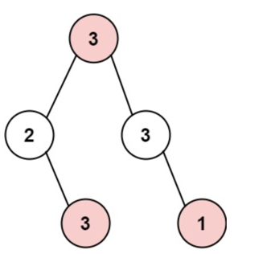

# 动态规划
## 理论基础
动态规划包括哪种问题？
- 基础问题，斐波那契额数列、爬楼梯。
- 背包问题
- 打家劫舍
- 股票问题
- 子序列问题  
  

动态规划类题目解题思路
- DP数组定义以及下标的含义
- 递推公式
- dp数组如何初始化
- 遍历顺序
- 打印dp数组，分析上述四点是否与代码相同。

## 算法题目
### 1. 斐波那契数列
力扣地址： https://leetcode.cn/problems/fibonacci-number/description/  
项目代码： DFibonacci.class  
题目简短描述： 斐波那契数列 f(n) = f(n - 1) + f(n - 2);  1 1 2 3 5。 求f[n]  
核心代码：
``` java.
        int[] dp = new int[n + 1];
        dp[0] = 0; dp[1] = 1;
        for(int i = 2; i <= n; i++){
            $dp_{i}$ = dp[i - 1] + dp[i - 2];
        }
        return dp[n];
        
        /** 状态压缩*/
        int dp0 = 0;int dp1 = 1; int sum = dp0 + dp1;
        for(int i = 2; i <= n ; i++){
            sum = dp0 + dp1;
            dp0 = dp1;
            dp1 = sum;
        }
        return sum;
        
        /** 递归*/
        if(n < 2){return n;}
        return solveByRecursion(n - 1) + solveByRecursion(n - 2);
```
算法思路：
- 确定DP数组含义： $dp_{i}$表示第i个斐波那契数
- 确定递推公式： 题目中已经给出 $dp_{i}$ = dp[i - 1] + dp[i - 2];
- dp数组如何初始化： 题目中已经给出 dp[0] = 1, dp[1] = 1;
- 遍历顺序： 从前向后遍历才能保证$dp_{i}$可以由dp[i - 1] 和dp[i - 2]计算得来。
- 打印dp数组： 用来debug，快速定位问题。     

其他解法：
- 上述提供了动态规划解法，这里提供两种其他解法。
- 状态压缩
  - 观察代码我们可以看到，题目中只需要求出dp[n]即可，我们可以不必定义一个dp数组，而是用滚动数组的方式来表示 f[n]、f[n - 1]、f[n - 2];
- 递归
  - 本题使用递归会导致严重的时间复杂度2的n次方，不建议使用。
  - 递归终止条件，当n小于2时 n= 0或1此时直接返回初始值 0 ， 1。
  - 递归压栈：每一次压入n- 1 与 n - 2,递归计算二者之和。

具体实现：
- 实现。

### 2. 爬楼梯
力扣地址： https://leetcode.cn/problems/climbing-stairs/description/  
项目代码： DClimbingStairs.class   
题目描述：上台阶问题，一次可以上1阶或2阶，求n个台阶一共有多少种方案。  
简要分析：
- 1 阶台阶 一种方案 1
- 2 阶台阶 两种方案 11 2
- 3 阶台阶 可以从1阶台阶迈两步 或 从2阶台阶迈一步得来 共有 (1阶台阶方案 + 2阶台阶方案) 种方案
- 4 阶台阶 (3阶台阶方案 + 2阶台阶方案) 种方案。
- 至此我们不难分析出递推公式：
  - n 阶台阶 f(n) = f(n - 1) + f(n - 2) n > 2  

核心代码：
``` java.
        int[] dp = new int[n + 1];
        dp[1] = 1;
        dp[2] = 2;
        for(int i = 3; i <= n ; i++){
            $dp_{i}$ = dp[i - 1] + dp[i - 2];
        }
        return dp[n];
```
算法思路：
- 确定DP数组以及下标的含义：$dp_{i}$ 表示达到第i阶有$dp_{i}$种方案。
- 确定递推公式：$dp_{i}$ = dp[i - 1] + dp[i - 2]
- dp数组如何初始化： 注意上述n需要大于2 dp[1] = 1, dp[2] = 2; 为什么不考虑dp[0]？ 题目中说n为正整数，所以不包含0；
- 确定遍历顺序： 从前向后遍历，$dp_{i}$ 依赖于dp[i -1] 与 dp[i -2]
- 打印dp数组：在for循环中可以进行打印  

具体实现：
- 类似于斐波那契数列，不再赘述。  

### 3. 使用最小花费爬楼梯
力扣地址： https://leetcode.cn/problems/min-cost-climbing-stairs/description/  
项目代码： DMinCostClimbingStairs.class  
核心代码：  
题目描述：cost数组表示你每次向上爬台阶的话费，你可以从0或1开始走1或2步，求最小花费。注意我们要明确两点：
- 1 开始站位你可以站到0，1 并不会花费
- 2 结束位置要大于n 如 cost 0,1,2。那么我们结束位置要在3的位置。
``` java.
        int n = cost.length;
        int[] dp = new int[n + 1];
        dp[0] = 0; dp[1] = 0;
        for(int i = 2; i <= n ; i++ ){
            $dp_{i}$ = Math.min(dp[i - 1] + cost[i - 1], dp[i - 2] + cost[i - 2]);
        }
        return dp[n];
```
算法思路：  
- 明确DP数组及下标含义：$dp_{i}$ i表示到了哪个台阶，$dp_{i}$表示到达下标i位置的最小花费。
- 确定递推公式： $dp_{i}$ = Math.min(dp[i - 1] + cost[i - 1], dp[i - 2] + cost[i - 2])
- dp数组如何初始化： 分析递推公式基础在于dp[0] 与 dp[1], 后续的所有dp元素都可以根据dp[0]dp[1]计算得来。
题目中说可以从0或1开始，走1，2步向上跳的时候才会产生花费。 所以dp[0] = 0, dp[1] = 0。向上跳的时候才会产生花费。
- 确定遍历顺序： 从前向后，$dp_{i}$ 依赖于前两个元素。
- 打印dp数组：for循环中可以打印。

具体实现：
- 注意实现的小细节，为什么这里我们dp数组初始化要到 n+ 1个元素，这是因为我们需要爬过cost数组的所有台阶。
- 返回的是上到n阶台阶的最小花费。  

## 二维动态规划问题
### 4. 不同路径
力扣地址： https://leetcode.cn/problems/unique-paths/description/  
项目代码： DUniquePaths.class  
题目描述： 在一个给定m x n网络中，从左上角出发到右下角一共有多少种方案，每次只能向下或向右。

核心代码：
``` java.
        int[][] dp = new int[m][n];
        // 初始化
        for(int i =0;i<m;i++){$dp_{i}$[0] = 1;}; // 初始化第一列
        for(int j =0; j < n; j++){$dp_{0,j}$ = 1;}// 初始化第一行
        for(int i = 1; i < m; i++){
            for(int j = 1; j < n; j++){
                $dp_{i,j}$ = $dp_{i-1,j}$ + $dp_{i}$[j -1];
            }
        }
        return dp[m - 1][n -1];
```
算法思路：
- **明确DP数组及下标含义：** $dp_{i,i}$,从0，0到i，j有多少种不同的路径。
- **确定递推公式：** dp[i,j]可以由上面的元素 dp[i - 1,j]，和左边的元素dp[i, j -1]推导而来。
可以分析出递推公式：dp[i,j] = dp [i - 1, j] + dp[i, j -1];
- **dp数组如何初始化：** 从递推公式可以看出每一个元素都是由上方元素和左方元素推导得来，所以$dp_{0,j}$行要初始化，$dp_{i}$[0]也要初始化。
初始化的值为1，从起点出发到达第0行所有元素和第0列所有元素都是一种方法，一直向右或一直向左。
- **确定遍历顺序：** 每一个状态依赖于上面和左面元素，遍历顺序为从左往右，从上向下进行遍历。
- **打印dp数组：** 排查错误

具体实现：
- 注意最终的结果直接返回$dp_{m-1,n-1}$即可

### 5. 不同路径二
力扣地址： https://leetcode.cn/problems/unique-paths-ii/description/  
项目代码： DUniquePathsTwo.class  
题目描述： 在一个给定的二维数组种，从左上角出发到右下角一共有多少种方案，每次只能向下或向右,现在存在障碍用1表示。  

核心代码：
``` java.
        int m = obstacleGrid.length;
        int n = obstacleGrid[0].length;
        int[][] dp = new int[m][n];
        // 初始化
        if(obstacleGrid[0][0] == 1 || obstacleGrid[m - 1][ n - 1] == 1)return 0;
        for (int i = 0; i < m; i++){
            if(obstacleGrid[i][0] == 1){
                break;
            }
            $dp_{i}$[0] = 1;
        }
        for (int j = 0; j < n ; j++){
            if(obstacleGrid[0][j] == 1){
                break;
            }
            $dp_{0,j}$ = 1;
        }
        // 开始遍历
        for(int i = 1; i < m ; i++){
            for(int j = 1; j < n ; j++){
                if(obstacleGrid[i][j] == 0){
                    $dp_{i,j}$ = $dp_{i-1,j}$ + $dp_{i}$[j -1];
                }else{
                    $dp_{i,j}$ = 0;
                }
            }
        }
        return dp[m - 1][n - 1];
```
算法思路：
- **写在前面：** 本题与上一题最大的区别是加入了障碍，这样我们在进行初始化和计算$dp_{i,j}$的时候都需要进行判断障碍。
- **明确DP数组及下标含义：** $dp_{i,j}$表示从左上到右下一共有多少种方案。
- **确定递推公式：** $dp_{i,j}$ = $dp_{i-1,j}$ + $dp_{i}$[j - 1] 
- **dp数组如何初始化：** 对第一行第一列进行初始化，如果遇到障碍，则当前节点和后续节点都为0。需要注意的是如果左上和右下任意一个节点为障碍那么将会有0种方案。
- **确定遍历顺序：** 从左到右 从上到下进行遍历。
- **打印dp数组：**
具体实现：
- 参数判断处：我们需要判断obs数组是否为空和左上角右下角是否为障碍，如果为障碍那么直接返回0即可。
- 初始化处：如果当前初始化节点为障碍，那么我们当前和后续元素全初始化为0。
- 遍历处：如果当前节点为障碍，那么表示所有路径都不可到达当前节点，所以置为0。

## 固定遍历问题
### 6. 整数拆分
力扣地址： https://leetcode.cn/problems/integer-break/description/  
项目代码： DIntegerBreak.class  
简短描述： 给定一个整数n，拆分得到乘积最大，返回这个乘积。  
核心代码：
``` java.
        int[] dp = new int[n + 1];
        dp[0] = 0; dp[1] = 0; dp[2] = 1;
        for(int i = 3; i <= n; i++){
            for(int j = 1; j < i; j++){
                $dp_{i}$ = Math.max($dp_{i}$, Math.max(j * (i - j), j * dp[i - j]));
            }
        }
        return dp[n];
```
算法思路：
- **明确DP数组及下标含义：** $dp_{i}$表示对i进行拆分，拆分后得到的最大乘积为$dp_{i}$。
- **确定递推公式：** i -> j * (i- j) 拆成两个数 -> j *（dp[i - j]）多个数 -> $dp_{i}$ = j * dp[i - j]。固定j继续拆分i-j，j可以用遍历的方式取最大值。
  以拆6为例：
  - 1 * 5 或 1 * dp[5] 可以拆分成 1 * 5 或 1* 5的继续拆分。 dp[6] 应该取二者的最大值。
  - 2 * 4 或 2 * dp[4] 注意这里,为什么2可以固定，2拆分的情况 拆成 1 * 1已经包含在 上一个拆分1 * dp[5]中了。
  - 3 * 3 或 3 * dp[3]
  - 4 * 2 或 4 * dp[2]
  - 5 * 1 或 5 * dp[1]
  - 递推公式总结为：$dp_{i}$ = Max(j * (i - j) , j * dp[i - j]); 前者拆分成两个数，后者拆分成两个或以上的数，$dp_{i}$为二者的最大值。 
- **dp数组如何初始化：** dp[0]无意义 = 0, dp[1] 无意义 = 0, dp[2] = 1 * 1 = 1
- **确定遍历顺序：** i从i=3开始遍历，正向遍历，i<= n。j正向遍历从1开始到 i-1 结束且包含i-1。
- **打印dp数组：** 可以输出dp数组排查问题。

具体实现：
- 注意固定j 那么j的取值范围要为 1到i-1。
- 优化，j的取值不必直接到i-1,可以到 i/2 即可，有数学证明可以证明，类似于小的优化方案。
### 7. 不同的二叉搜索树
力扣地址： https://leetcode.cn/problems/unique-binary-search-trees/description/ 
项目代码： DUniqueBinarySearchTrees.class  
简单描述： 给定一个整数n，求可以构造出多少种不同的1-n为节点的二叉搜索树。
- 二叉搜索树：任意节点的左子树中所有节点的值都小于该节点的值，右子树中所有节点的值都大于该节点的值。注意null也是二叉搜索树。

核心代码：
``` java.
        int[] dp = new int[n + 1];
        dp[0] = 1; dp[1] = 1;
        for(int i = 2; i <= n; i++){
            for(int j = 1; j <= i; j++ ){
                $dp_{i}$ += dp[j - 1] * dp[i - j];
            }
        }
        return dp[n];
```
算法思路：
- 分析：
  - 以n = 3进行分析，n = 3，我们可以以根节点为 1，2，3来构造二叉搜索树
  - 以1为根节点 ： 左子树0节点 * 右子树2节点
  - 以2为根节点 ： 左子树1节点 * 右子树1节点
  - 以3为根节点 ： 左子树2节点 * 右子树0节点
  - 由此可得 dp[3] = dp[0] * dp[2] + dp[1] * dp[1] + dp[2] * dp[1];
  - 进而可以将3扩充到n的情况得出递推公式。
- **明确DP数组及下标含义：** $dp_{i}$表示 1-i为节点可以构造出$dp_{i}$中二叉搜索树。
- **确定递推公式：** 由分析可得 $dp_{i}$ =   sum j = 1到n-1(dp[j - 1] * dp[i - j]); 1 - j - i;
- **dp数组如何初始化：** dp[0] 0个节点有多少种不同的二叉搜索树？ 1个 null树也是二叉搜索树。dp[0] = 1 dp[1] = 1 一个节点可以有多少种二叉搜索树？ 1个
- **确定遍历顺序：** 从小到大遍历i dp数组依赖前面的状态。 j的范围为1到n
- **打印dp数组：**

具体实现：
- 注意初始化 null 树也算二叉搜索树 所以dp[0] = 1, 当有一个节点时也是二叉搜索树，所以dp[1] = 1
- 遍历dp数组，内层遍历以j为根节点的情况 j的取值范围为 1到 i ，i可以取到。

## 背包问题
### 理论基础
首先来看背包问题的分类（物品个数上的不同是区分背包问题种类的关键）


### 01背包问题
有**n种物品**，每种物品有一个，每个物品有自己的**重量**和**价值**，有一个最多能放**m重量**的背包，问背包能装的**最大价值**的物品是多少。  

物品数组weight[i] ，表示物品i的重量为weight[i]。

价值数组values[i]，表示物品i的价值为values[i]。

背包最大重量capacity，表示背包能装下的最大重量。

|        | 重量 | 价值 |
| :----: | :--: | :--: |
| 物品0  |  1   |  15  |
| 物品1  |  3   |  20  |
| 物品2s |  4   |  30  |

背包最大重量为4，求能够存放最多多少价值的物品

#### 暴力解法（回溯）  
每个物品只有两种状态取或不取，可以采用回溯算法。时间复杂度为2^n。  

算法思想：
- 从第i个物品开始，递归处理每个	物品的两种选择
  - 选 当前物品重量小于等于背包容量，选择该物品，更新总重量、总价值，递归处理下一个物品。
  - 不选 直接跳过当前物品，递归处理下一个物品
- 递归终止条件：遍历完所有物品index == n ，此时记录当前组合的价值
- 全局需要维护一个最大价值变量，每次递归进行更新  

代码实现：
``` java.
    public static int maxValue;
    public static int solveByViolent(int[] weights, int[] values, int capacity){
        maxValue = 0; // 初始化最大值
        dfs(weights, values, capacity, 0,0,0);
        return maxValue;
    }
    /**
     * 深度优先搜索（递归核心）
     * @param weights 物品重量数组
     * @param values 物品价值数组
     * @param capacity 背包最大容量
     * @param index 当前处理的物品索引
     * @param currentWeight 当前组合的总重量
     * @param currentValue 当前组合的总价值
     */
    public static void dfs(int[] weights, int[] values, int capacity,
                           int index, int currentWeight, int currentValue){
        // 递归终止条件，当前遍历位置等于物品长度
        if(index == weights.length){
            // 若总重量小于容量，且当前currentValue 大于maxValue 则更新maxValue
            if(currentWeight <= capacity && currentValue > maxValue){
                maxValue = currentValue;
            }
            return;
        }

        // 减枝
        if(currentWeight > capacity){
            return; // 当前容量已经大于最大容量了后续不必遍历
        }

        // 决策1 不选第index个物品，直接递归下一个物品
        dfs(weights, values, capacity, index + 1, currentWeight, currentValue);

        // 决策2 选择第index个物品，需要满足重量小于容量
        int newWeight = currentWeight + weights[index];
        int newValue = currentValue + values[index];
        dfs(weights, values,capacity, index + 1, newWeight, newValue);
    }
```

##### 回溯算法思想：

- 首先维护一个全局变量maxValues用于存储最大价值。
- solve函数
  - 初始化全局maxValues变量(初始化为0)
  - 调用dfs函数，dfs(重量数组、价值数组、最大容量、当前物品index 0、当前容量 0、当前价值 0)
- dfs函数，参数(重量数组weight、价值数组values、最大容量capacity、当前物品位置index、当前容量 currentWeight、当前价值currentValues)
  - 首先要考虑递归结束条件，什么时候应该结束回溯。既当遍历到最后一个物品时结束递归index == weight.lenght
    - 结束的时候我们应该做什么？ 如果currentWeight <= capacity 且 currentValues > maxValues 我们更新最大价值，表示选择这条路线。
  - 考虑能否剪枝即跳出无用的循环？是可以的当当前物品重量currentWeight已经 >= 容量capacity了，说明后续所有物品已经放不下了，我们跳出回溯。
  - 进入到核心决策
    - 决策一：不选择当前物品，我们直接调用dfs递归 保持所有参数不变且物品index + 1。
    - 决策二：选择当前物品，如果选择当前物品的话，我们需要更新currentWeight与currentValues并且物品index + 1，继续调用dfs递归。
- 至此回溯完毕。
#### 动态规划思路解法

使用回溯算法的时间复杂度来到了2的n次方，我们需要一个新的算法来解决这个问题。动态规划是一个非常经典的方案，要使用动态规划就要从二维dp数组开始！

##### 二维dp数组解法  

首先我们还是从动规五部曲开始：

- **明确DP数组及下标含义：** $dp_{i,j}$ 表示下标为0到i之间的物品任取(但要保证总重量不超过背包容量)，放入容量为j的背包里的最大价值。
- **确定递推公式：**
  - 当前背包$dp_{i,j}$可以由哪几个方向推导出来？
    - 不放物品i  最大价值等于```dp[i-1][j]``` 。
    - 放物品i 最大价值等于背包容量减去物品i的容量所能放的最大容量加上物品i的价值。   
      ```maxvalue = dp[i - 1][j - weight[i]] + value[i]```;
    - 二者取最大即可。
  - 最终递推公式为：```dp[i][j] = max(dp[i][j] , dp[i - 1][j - weight[i]] + value[i])```
- **DP数组如何初始化：** 由于当前$dp_{i,j}$由上面元素和左上元素推导得来，并且我们很好的能够初始化第一行与第一列数据。
  - 第一列，$dp_{i}$[0] 此时容量为0因此最大价值都为0
  - 第一行，$dp_{0,j}$ 只要考虑物品0，当容量j大于等于物品0的重量时，初始化$dp_{0,j}$ = 物品0的价值，后续元素全部保持为物品0的价值。
  - 其余元素，由于其余元素都由上面元素和左上元素推导得来，因此初始化任意值即可，在java种new int[][]会自动初始化为0。
- **确定遍历顺序：**
  - 两层for循环，外层for循环遍历物品 ，内层for循环遍历背包。
- **打印DP数组：** 遇到问题可以打印dp数组分析（这里建议编写打印二维数组函数更便于操作）。  

dp数组初始化表格

|       | 背包容量 |  0   |  1   |  2   |  3   |  4   |
| :---: | :------: | :--: | :--: | :--: | :--: | :--: |
| 物品0 |    0     |  0   |  15  |  15  |  15  |  15  |
| 物品1 |    1     |  0   |  0   |  0   |  0   |  0   |
| 物品2 |    2     |  0   |  0   |  0   |  0   |  0   |

背包容量为0 最大价值都是0 所以第一列初始化为0. 第一行背包容量不断扩大到4，只装物品0的价值.

其他位置初始化多少都可以不会影响当前元素的求值。

核心代码：
``` java.
     public static int solveByDP(int[] weights, int[] values, int capacity){
        // 边界校验，重量数组空 价值数组空 重量数组长度不等于价值数组 容量小于等于0 都属于异常情况
        if(weights == null || values == null || weights.length != values.length || capacity <= 0){
            return 0;
        }

        // 初始化dp
        int dpRows = weights.length; // 物品一共有多少个
        int dpCols = capacity + 1;
        int[][] dp = new int[dpRows][dpCols];

        // 初始化第一行
        for(int j = 0; j < dpCols;  j++){
            if(weights[0] <= j){
                dp[0][j] = values[0];
            }
        }
        // 初始化第一列 由于java new int[][] 会自动赋初值0，所以我们不必初始化
        System.out.println("初始化dp数组：");
        printDPArray(dp);
        // 开始遍历 外层物品，内层容量
        for(int i = 1; i < dpRows; i ++){
            for(int j = 0; j < dpCols; j++){
                // 剪枝，如果当前背包容量小于当前物品重量，那么无论如何都无法放入背包，我们直接取dp数组上方的值。
                if(j < weights[i]){
                    // 不放物品i 当前物品的重量大于j容量
                    dp[i][j] = dp[i-1][j];

                }else {
                    // 当前容量在加入当前物品重量的情况下不超重，我们有两种方案，放或者不放。
                    // 方案一放 那么我们的最大价值就是 dp[i - 1][j - weights[i]](物品0到物品i-1 放与不放，重量减去当前重量) + 当前物品价值
                    // 方案二不放 那么我们的最大价值还是dp数组上方的$dp_{i-1,j}$
                    // 具体取方案一还是方案二要取决于二者谁的价值最大，我们取价值最大的那个方案。
                    dp[i][j] = Math.max(dp[i-1][j], dp[i -1][j - weights[i]] + values[i])
                }
            }
        }
        return dp[dpRows - 1][dpCols -1];
    }
    // 打印dp数组函数
    public static void printDPArray(int[][] dp){
        int row = dp.length;
        int col = dp[0].length;
        for(int i = 0; i < row; i++){
            StringBuilder sb = new StringBuilder();
            for(int j = 0; j < col; j++){
                sb.append(dp[i][j]);
                sb.append(" 、");
            }
            System.out.println(sb.toString());
        }
    }
```

#### 滚动数组（一维数组解法，动规问题核心解法）
将上述的二维dp数组进行压缩得到一维数组的解法。  
需要注意的是在一维dp数组遍历中$dp_{j}$表示容量为j的背包能够存储的最大价值。  
需要两层遍历，外层for循环遍历物品 从物品0到最后一个物品。一次次的放入dp数组中取最大值。  
内层for循环遍历容量，这里需要倒叙遍历，为了防止$dp_{j}$依赖于dp[j - weight[i]]导致物品重复放入。  
内层for循环可以采用剪枝的思想，如果当前容量小于物品重量则一定不可放入直接跳出循环即可。


算法思路：
- **明确DP数组及下标含义：** $dp_{i}$ 容量为j的背包的最大价值
- **确定递推公式：** $dp_{i}$ = Math.max($dp_{i}$ 不放物品i, dp[j - weight[i]] + values[i] 放物品i)
- **dp数组如何初始化：** dp[0] 背包容量为0所能装的最大价值为0 dp[0] = 0，非0下标初始化 $dp_{i}$由于需要与自身取最大值，我们需要初始化一个非零最小值来避免覆盖正确值。$dp_{i}$ = 0。
- **确定遍历顺序：** 两层for循环，外层遍历物品 从前向后，内层遍历背包，从大到小倒叙。为什么内层要倒叙？ 由于我们的递推公式，$dp_{i}$依赖于dp[i-1]的状态，如果我们正序遍历则会导致物品重复添加的问题。
- **打印dp数组：**

核心代码：
``` java.
        // 边界校验
        if(weights == null || values == null || weights.length != values.length || capacity <= 0){
            return 0;
        }

        // 初始化dp
        int itemNumber = weights.length; // 物品数量
        int[] dp = new int[capacity + 1]; // dp数组，数量要为容量（包含容量）所以这里加一
        // 初始化dp数组 都为0 Java new int[] 会自动赋初值0，所以不必初始化

        // 遍历
        for(int i =0; i < itemNumber; i++){
            for(int j = capacity; j >= weights[i]; j --){
                dp[j] = Math.max(dp[j] , dp[j - weights[i]] + values[i]);
            }
        }
        return dp[capacity];
```


### 8. 分割等和子集
力扣地址： https://leetcode.cn/problems/partition-equal-subset-sum/description/  
项目代码： DPartitionEqualSubsetSum.class    
简短描述： 给定一个数组，判断能否分割成两个和相同的子集。返回boolean值。   
问题转化： 我们可以转化问题，数组所有元素和为sum，题目转化为 01背包，容量为sum/2 每个物品只装一次，能否装满容量？  
nums[i] 表示物品i的重量 也表示物品i的价值，背包容量为target = sum / 2  
target等与sum /2，如果最后容量为target的背包能够装的价值为target那么就表示可以分割成两个和相同的子集。

核心代码：
``` java.
      public static boolean solve(int[] nums){
        int sum = 0;
        for(int i : nums){
            sum += i;
        }
        if(sum % 2 != 0){return false;}
        int target = sum / 2;

        // 初始化dp
        int[] dp = new int[target + 1];

        // 遍历
        for(int i = 0; i < nums.length; i++){
            for(int j = target; j >= nums[i]; j --){
                dp[j] = Math.max(dp[j], dp[j - nums[i]] + nums[i]);
            }
        }
        // 判断是否满足两个子集和相同
        if(dp[target] == target){
            return true;
        }else {
            return false;
        }
    }
```
算法思路：
- **明确DP数组及下标含义：** dp数组， $dp_{j}$ 容量为j的背包最大价值为$dp_{j}$。如何判断背包是否装满？ dp[target] == target 说明背包可以装满，target = sum / 2
- **确定递推公式：** ```dp[j]= max(dp[j], dp[j - weight[j]] + value[j]) -> 本题 dp[j] = max(dp[j], dp[j - nums[i] + nums[i]]);```
- **dp数组如何初始化：** dp[0] = 0, 非0下标dp数组也初始为0
- **确定遍历顺序：** 外层fro从前往后遍历物品，内层for从后向前遍历背包
- **打印dp数组：**

具体实现：
- 注意题目转换，将原问题转换为01背包问题
- 那么对于背包问题我们需要知道什么元素呢？
  - 物品数组以及物品重量 weight[]， 这里就是我们的nums数组
  - 物品价值数组 values[]， 这里也是我们的nums数组
  - 背包容量，capacity， 这里是我们的sum /2。
- 那么如何判断是否可以凑成两个相同的子集呢
  - 只需要判断dp[capacity] == capacity 即可，如果可以，说明物品中可以组合成和为target也就是sum一半的物品，那么剩下的一半物品自然也就和target的值相等。

### 9. 最后一块石头的重量
力扣地址： https://leetcode.cn/problems/last-stone-weight-ii/description/  
项目代码： DLastStoneWeightTow.class   
简短描述： 任取两个石头相撞，消失掉相同的重量，求最后剩余石头重量。
核心代码：

``` java.
    public int lastStoneWeightII(int[] stones) {
        int sum = 0;
        for(int s : stones){
            sum += s;
        }
        int target = sum / 2; // 自动向前取整
				// 初始化dp数组
        int[] dp = new int[target + 1];
        dp[0] = 0;
        // 遍历
        for(int i = 0; i < stones.length; i++){ // 物品
            for(int j = target; j >= stones[i] ; j--){ // 背包
                dp[j] = Math.max(dp[j], dp[j - stones[i]] + stones[i]);
            }
        }

        return  Math.abs(2 * dp[target] - sum); // 推导 一堆为dp[target] 另一堆 sum - dp[target]，二者相减取绝对值。
    }
```
算法思路：
- **明确DP数组及下标含义：** $dp_{j}$, 装满容量为j的背包的最大重量。
- **确定递推公式：** ```dp[j] = max(dp[j], dp[j - weight[j] + values[j]) -> 本题 dp[j] = max(dp[j], dp[j - stones[i]] + stones[i]);```
- **dp数组如何初始化：** dp[0] 初始化为0，非零元素初始化非负最小(0)。
- **确定遍历顺序：** 两层for ，第一层for遍历物品，第二层遍历背包倒序。
- **打印dp数组：**

具体实现：
- 注意这里一定不要走入题目中的模拟，要站在更高维度考虑这个问题。
- 每一次两个石头相撞 -> 将所有石头分为两个重量相似的数组 再相撞所得到的剩余重量就是题目所求。
- 01背包元素：
  - 物品数组：这里就是stones数组，下标表示物品，stones[i]表示物品i的重量。
  - 价值数组：这里还是stonrs数组，下标表示物品，stones[i]表示物品i的价值。
  - 容量：capacity 这里就是 sum/2 ，dp[capacity] 就是一个数组的石头重量，那么另一堆石头重量就是 sum - dp[capacity]，二者相减取绝对值就是题目所求。
### 装满背包有多少种方案系列
### 10. 目标和
力扣地址： https://leetcode.cn/problems/target-sum/description/  
项目代码： DTargetSum.class  
简短描述： 给定一个数组nums和一个目标数S 对于数组中任意一个元素你可以选择添加+ 或 - 来使得最终数组和sum等与S。输出所有可能的方案数。
核心代码：
``` java.
    public static int solve(int[] nums, int target){
        // 计算容量
        int sum = 0;
        for(int n : nums){
            sum += n;
        }
        /**
         * 本题我们将数组分为两部分 left 与 right，有题意可得
         * left + right = sum， left - right = target。合并right可得
         * left = (sum + target) / 2。我们以left作为背包容量
         */
        int left = (sum + target) / 2; 
        // 边界分析
        if((sum + target) % 2 != 0 || Math.abs(sum) < Math.abs(target)){return 0;}

        // 初始化dp, dp[j]表示容量为j的背包有dp[j]中方案可以通过重量构造成j
        int[] dp = new int[left + 1];
        dp[0] = 1; // 对于方案数问题dp[0]一定要初始化为1

        for(int i = 0; i < nums.length; i++){
            for(int j = left; j >= nums[i]; j--){
                dp[j] = dp[j] + dp[j - nums[i]];
            }
        }

        return dp[left];
    }
```
算法思路：
- **明确DP数组及下标含义：** $dp_{j}$ 装满背包容量为j的背包有$dp_{j}$种方法
- **确定递推公式：**``` dp[j] = dp[j] + dp[j - nums[i]];```
- **dp数组如何初始化：** 对于方案类型问题dp[0] 必须等于= 1,可以举nums = {0} , target = 0 这种情况的例子。如果为0则后续所有元素都为0了。
- **确定遍历顺序：** 两层for，外层从小到大遍历物品，内层从容量到当前nums[i]倒叙遍历容量。
- **打印dp数组：**

具体实现：
- 要注意题目转换，对于题目所求，我们可以拆分成left 与 right两个子集，且满足 left  - right = target。又有 left + right = sum我们最终推导出
  left = （target + sum）/ 2。题目转换为有一个容量为left的背包，和一个物品数组nums 用物品数组装满这个背包有多少种方案？
  - 注意 如果 left不为整数，说明数组无解。
- 这里是装满容量为j的背包，求有多少种方案问题。递推公式为``` dp[j] = dp[j] + dp[j - nums[i]];```
- 初始化dp[0] 这里表示装满容量为0的背包有多少种方案，我们要初始化为1。不能初始化为0否则后续所有数据都计算成0了，而且容量为0的背包也有一种方案装满那就是什么都不装。


### 11. 一和零
力扣地址： https://leetcode.cn/problems/ones-and-zeroes/description/  
项目代码： DOnesAndZeroes.class  
简短描述： 给定一个string[] 数组元素为包含0，1的字符串。给定m,n求满足m个0 n个1的最大子集。
核心代码：

``` java.
     public static int solve(String[] str, int m, int n){
        // 初始化dp
        int[][] dp = new int[m + 1][n + 1];

        // 遍历
        for(int s = 0; s < str.length; s++){  // 遍历物品 正向
            // 计算当前字符串的1和0的个数
            String curr = str[s];
            int x = 0; int y = 0;
            for(int c = 0; c < curr.length(); c++){
                if(curr.charAt(c) == '0'){
                    x++;
                }else {
                    y++;
                }
            }

            // 遍历背包倒序 二者可以颠倒顺序
            for(int i = m; i >= x; i--){ 
                for(int j = n; j >= y; j--){
                		dp[i][j] = Math.max(dp[i][j], dp[i-x][j-y] + 1);
                }
            }

        }

        // 返回
        return dp[m][n];
    }
```
算法思路：
- **说明：** 对于本题，实际是01背包问题，需要理解背包容量，这里背包的容量是二维的有m有n。
- **明确DP数组及下标含义：** $dp_{i,j}$,表示含有i个0，j个1的最大子集个数
- **确定递推公式：** 可以由01背包经典装满背包的最大价值递推公式推导而来
  - 01背包经典公式 ```dp[j] = max(dp[j], dp[j - weight[i]] + values[i])```
  - 本题需要明确：什么是物品？ 字符串数组中元素，物品重量？ 字符串数组中元素含有0和1的个数分别以x,y表示。什么是背包容量? 给定的m和n。
  - 那么本题由于背包是二维背包首先我们来看放当前物品的情况  
  $dp_{i,j}$ = $dp_{i-x,j-y}$ + 1, 这里x，y是str数组当前元素的0，1数量也就是weight数组，+1 表示题目中所求的是子集个数。如果当前元素放入背包那么这里的最大子集长度为减去当前子集含有的01个数的最大子集长度加上1（当前子集）。
  - 不放当前物品的情况那么 $dp_{i,j}$ = $dp_{i,j}$
  - 二者取最大值就是递推公式，所以我们有 ```dp[i][j] = Math.max(dp[i][j], dp[i-x][j-y] + 1)```
- **dp数组如何初始化：** $dp_{0,0}$表示含有0个0，0个1的最大子集长度这里为0，非零元素 由于每次遍历都会取最大值我们初始化为0即可。
- **确定遍历顺序：** 外层遍历物品，也就是str数组，内层遍历背包倒叙注意这里内层的遍历需要两层for循环来完成二维背包的遍历。
- **打印dp数组：**

具体实现：
- 转化为01背包问题时要想清楚 物品数组是什么 背包容量是什么 价值数组是什么，想清楚这三点之后就可以套用经典公式来解决。
- 本题 物品数组 str数组，物品重量就是str数组每一个子集中0，1的个数。
- 背包容量，这里背包升级成二维，m和n需要都满足才能达到最大容量。
- 价值数组，这里的价值数组由于是计算个数 那么个元素是否放入就是他的价值，放入为1 不放入为0。

### 完全背包问题
在01背包问题中，我们介绍了每一个物品仅可使用一次，利用dp数组求背包能承载物品的最大价值问题。  
完全背包则是01背包的延展，在完全背包中，物品的使用次数变为无限，这样我们如何求得最大价值？  
案例问题：  
有n种物品，每种物品有无限个，每个物品有自己的重量和价值，有一个最多能放m重量的背包，问背包能装的最大价值的物品是多少。

|       | 重量 | 价值 |
| ----- | ---- | ---- |
| 物品0 | 1    | 15   |
| 物品1 | 3    | 20   |
| 物品2 | 4    | 30   |

背包最大重量为4，求能够存放最多多少价值的物品

先来回顾一下01背包解决背包能装的最大价值代码：

``` java.
       for(int i =0; i < weight.length; i++){
          for(int j = bagWeight; j >= weight[i]; j --){
          		dp[j] = Math.max(dp[j], dp[j - weight[i]] + values[i]);
          }
       }
       retrun $dp_{j}$;
```
那么如何才能让物品使用次数变为无限呢？  
注意在01背包中内层遍历背包容量是倒序遍历，这是因为我们要避免一个物品使用多次从而不停的更新$dp_{j}$。在完全背包中我们则不必考虑物品被多次使用，因为物品本身就是无限的
所以我们的代码可以将内层遍历背包改为正序遍历即可。

``` java.
       for(int i =0; i < weight.length; i++){ // 遍历物品
          for(int j = weight[i]; j <= bagWeight; j++){ // 遍历背包
          		dp[j] = Math.max(dp[j], dp[j - weight[i]] + values[i]);
          }
       }
       retrun dp[j];
```
**就是这么简单！**  
遍历顺序先物品再背包能否改变成先背包再遍历物品？  
是可以的！ 先物品再背包，每次是横向改变dp数组的值，而先背包再物品是每次纵向更新dp数组的值，可以用例子模拟一遍。  
**动规五部曲分析**

- **明确DP数组及下标含义：** $dp_{j}$ 表示容量为j的背包所能装物品的最大价值
- **确定递推公式：** ```dp[j] = Math.max(dp[j], dp[j - weight[i]] + values[i])```之前存的值与加入当前物品i的价值二者取最大值
- **dp数组如何初始化：** 从dp数组定义出发，当容量j为0时 不能装任何物品索引dp[0] = 0，非零元素由于每次与自身取max所以这里我们直接初始化为0即可。
- **确定遍历顺序：** 两层遍历，外层遍历物品数组，正序遍历。内层遍历背包数组，同样的正序遍历，由于这里可以使用多次物品，我们无需考虑后面的元素对前面元素的依赖问题，因此可以直接正序遍历。
- **打印dp数组：**

#### 完全背包主要用于解决 排列组合问题。
### 12. 零钱兑换2 组合问题 不关注元素顺序
力扣地址： https://leetcode.cn/problems/coin-change-ii/description/  
项目代码： DCoinChangeTwo.class  
核心代码：

``` java.
        // 初始化dp
        int[] dp = new int[amount + 1];
        dp[0] = 1;

        // 遍历 组合完全背包问题 注意递推公式与遍历顺序 先物品再背包 还是先背包再物品。
        for(int i = 0; i < coins.length; i++){ // 物品
            for(int j = coins[i]; j <= amount; j++){ // 背包容量
            		dp[j] = dp[j] + dp[j - conis[i]];
            }
        }

        return dp[amount];
```
算法思路：
- **明确DP数组及下标含义：** $dp_{j}$ 表示装满容量为j的背包有$dp_{j}$种方案。
- **确定递推公式：** $dp_{j}$ = $dp_{j}$ + dp[j - weight[i]]; 这个递推公式其实是由二维递推公式 压缩状态而来。
- **dp数组如何初始化：** dp[0] 表示容量为0的背包装满有几种方案 有一种 装0个数据 dp[0] = 1。注意这里如果初始化为0那么根据递推公式后续的元素都为0，无解了。非零变量初始化为0。
- **确定遍历顺序：** 两层遍历 第一层遍历物品正向，第二层遍历背包容量 正向。是否能更改顺序变成先背包再物品？ 请看末尾总结。
- **打印dp数组：**

总结： 
- **递推公式问题：** 对于求背包容量的排列组合问题 统一的递推公式是 $dp_{j}$ = $dp_{j}$ + dp[j -weight[j]];
- **排列组合问题：** 完全背包问题又分为两种 排列问题（考虑顺序，{1, 2},{2, 1}认为是两种） 组合问题（只关注组合 不考虑顺序 如 {1, 2} {2, 1}认为是一种）。
- **遍历顺序问题：** 完全背包章节中提到两层for循环可以颠倒既 我们既可以先遍历物品再遍历背包也可以先遍历背包再遍历物品，不会影响最终结果。  
  但这是对于求最大价值而言的，对于排列组合问题背包问题，遍历顺序影响了我们是求组合数还是求排列数。
  - 求组合数，先遍历物品再遍历背包。
  - 求排列数，先遍历背包再遍历物品。

### 13. 组合总和四
力扣地址： https://leetcode.cn/problems/combination-sum-iv/description/  
项目代码： DCombinationSumIV.class   
简短描述： 给定一个由不同数组成的数组nums，一个目标数target。返回所有组合为target的组合个数。注意{1, 2} 和 {2, 1}视为两种即为排列问题。  
核心代码：

``` java.
        // 定义dp数组
        int[] dp = new int[target + 1];
        // 初始化
        dp[0] = 1;

        // 遍历
        for(int j = 0; j <= target; j++){
            for(int i = 0 ; i < nums.length && j- nums[i] >= 0; i++){
            		dp[j] = dp[j] + dp[j - nums[i]];
            }
        }
        return dp[target];
```
算法思路：
- **明确DP数组及下标含义：** $dp_{j}$ 表示容量为j的背包能装的最大组合数。
- **确定递推公式：** 组成背包容量的方案个数递推公式 $dp_{j}$ = $dp_{j}$ + dp[j - weight[i]]; 
- **dp数组如何初始化：** dp[0] = 1; 当背包为0时有一种方案装满那就是什么也不放
- **确定遍历顺序：** 题目为排列问题，关注组成target元素的顺序，因此我们遍历顺序为 外层背包内层物品从小到大。
- **打印dp数组：**


### 14. 爬楼梯进阶版
力扣地址： 无力扣  
项目代码： DClimbingStairsUpdate.class    
简短描述： 在动规学习的开头，我们首先完成了爬楼梯一题，题目中给出了递推公式，相较于现在的我们来说已经很简单。我们要将问题升级既爬楼梯的步数可以是1-m个步数，问一共有多少种上到n阶的方法。  
题目：   
假设你正在爬楼梯。需要 n 阶你才能到达楼顶。

每次你可以爬至多m (1 <= m < n)个台阶。你有多少种不同的方法可以爬到楼顶呢？

注意：给定 n 是一个正整数。

输入描述：输入共一行，包含两个正整数，分别表示n, m

输出描述：输出一个整数，表示爬到楼顶的方法数。

输入示例：3 2

输出示例：3


核心代码：
``` java.
        // n 台阶，m 每一次可以上的步数
        // 构造物品数组
        int[] weight = new int[m];
        for(int i = 0; i < m ;i ++){
            weight[i] = i + 1;
        }
        // 初始化dp
        int[] dp = new int[n + 1];
        dp[0] = 1;
        // 遍历, 排列问题先背包再物品
        for(int j = 0; j <= n; j++){
            for(int i = 0; i < m; i++){
                // 防止步数超过台阶数量
                if(j - weight[i] >=0){
                		dp[j] = dp[j] + dp[j - weight[i]];
                }
            }
        }
        return dp[n];
```
算法思路：
- **明确DP数组及下标含义：** $dp_{j}$ 表示上到j个台阶有$dp_{j}$种方案
- **确定递推公式：** 排列组合问题递推公式 $dp_{j}$ = $dp_{j}$ + dp[j - weight[i]];
- **dp数组如何初始化：** dp[0] = 1,上0阶台阶共有不上这一个方案，其实是为了后续遍历不至于都为0而初始化为1的。
- **确定遍历顺序：** 排列问题 先背包再物品。
- **打印dp数组：**

具体实现：
- 可以创建物品数组weight 数组长度为m，元素为 1-m表示每一次可以上的台阶
- 开始遍历，排列问题先背包再物品
- 递推公式为 背包问题装满背包有几种方案的经典递推公式 $dp_{j}$ = $dp_{j}$ + dp[j - weight[i]]
- 注意，要判断j- weight[i]是否大于等于0，如果小于0说明当前背包装不下物品，所以直接break

### 15. 零钱兑换
力扣地址： https://leetcode.cn/problems/coin-change/description/  
项目代码： DSendCake.class  
简短描述： 给定一个硬币数组coins和一个金额amount，计算可以凑成金额所需要点最少硬币个数，硬币数量无限。  
背包问题抽象：完全背包问题，装满这个背包最少需要多少物品。  
核心代码：

``` java.
        // 初始化dp数组
        int[] dp = new int[amount + 1];
        dp[0] = 0;
        for(int i = 1; i < dp.length; i++){
            dp[i] = Integer.MAX_VALUE;
        }

        // 遍历
        for(int i = 0; i < coins.length; i++){ // 遍历物品
            for(int j = 0; j <= amount; j ++){ // 遍历背包
                // 注意当前容量必须大于物品重量，且dp[j - conins[i]]不是最大值的时候才可能采用放入当前物品的方案。
                if(j >= coins[i] && dp[j - coins[i]] != Integer.MAX_VALUE){
                		dp[j] = Math.min(dp[j], dp[j - coins[i]] + 1);
                }
            }
        }
        // 那么最终如果dp[j] = Integer.MAX_VALUE 说明无法凑成金额，返回-1
        return dp[amount] == Integer.MAX_VALUE ? -1 : dp[amount];
```
算法思路：
- **明确DP数组及下标含义：** $dp_{j}$ 表示容量为j的背包装满所需的最少物品为$dp_{j}$
- **确定递推公式：** $dp_{j}$= Math.min($dp_{j}$, dp[j - coins[i]] + 1); dp[j - coins[i]] 放当前硬币， +1 表示当钱硬币加入到结果中。
- **dp数组如何初始化：** dp[0] = 0, 非零元素由于取最小不能初始化为0 可以初始化为最大整数 Integer.MAX_VALUE
- **确定遍历顺序：** 两层for循环，外层遍历物品，内层遍历背包。由于是完全背包，内层遍历背包从小到大。
- **打印dp数组：**

具体实现：
- 注意：对于完全背包分为排列（强调物品顺序）和组合，但是本题由于求的是最小组合的元素个数所以不强调物品顺序，可以视为一个组合问题。
对于组合问题我们先遍历物品再遍历背包，同时完全背包问题内层遍历背包从小到大。
- 需要注意，题目中要求无法组成的金额返回-1 对于无法组成的金额我们dp数组为Integer.MAX_VALUE，因此我们首先要判断是否越界，在Java中如果Integer.MAX_VALUE + 1 则会发生溢出变成-的Integer.MAX_VALUE


### 16. 完全平方数
力扣地址： https://leetcode.cn/problems/perfect-squares/description/  
项目代码： DPerfectSquares.class  
简短描述： 给定一个正整数，用完全平方数去拼凑这个正整数，输出最小数量的组合的个数。

- 完全平方数 n = m * m
核心代码：
``` java.
        // 初始化dp
        int[] dp = new int[n + 1];
        dp[0] = 0;
        for(int i = 1; i < dp.length; i++){
            dp[i] = Integer.MAX_VALUE;
        }

        // 遍历
        for(int i = 1; i * i <= n ; i++){ // 物品
            for(int j = i * i; j <= n; j ++){ // 背包
                dp[j] = Math.min(dp[j], dp[j - i * i] + 1);
            }
        }

        return dp[n];
```
算法思路：
- **明确DP数组及下标含义：** $dp_{j}$ 装满容量为j的背包最少使用元素的个数为$dp_{j}$
- **确定递推公式：** $dp_{j}$ = min($dp_{j}$, dp[j - i * i] + 1);
- **dp数组如何初始化：** dp[0] = 0,非零元素由于递推公式取最小那么我们非零元素初始化为Integer.Max_value
- **确定遍历顺序：** 完全背包问题 先物品再背包同时背包从小到大遍历。
- **打印dp数组：**

具体实现：
- 注意，物品数组如何表示？ 物品数组就是i的完全平方数，那么开始要从1开始，结束条件为 i * i <= n。就是说i的平方数如果比n还大那么是不可能组成n的.
- 在上一题中我们数组中判断了Integer.MAX_VALUE + 1 越界的情况，这一题不会，是因为所有的数都可以由1的完全平方数组成。 

### 17. 单词拆分
力扣地址： https://leetcode.cn/problems/word-break/  
项目代码： DWordBreak.class  
简短描述： 给定一个字符串S，和一个单词数组wordDict。判断s是否可以被空格拆分为一个或多个在字典中出现的单词。  
题目转换： 可以转换成背包问题->字符串数组wordDict能否组成容量为S的背包 -> 完全背包，排列问题。
核心代码：

``` java.
        HashSet<String> dict = new HashSet<>(wordDict);
        // 初始化dp
        boolean[] dp = new boolean[s.length() + 1];
        dp[0] = true;

        // 遍历
        for(int j = 1; j <= s.length(); j++){ // 遍历背包
            for(int i = 0; i < wordDict.size(); i++){ // 遍历物品
                // 如果当前背包长度小于遍历到物品的长度，说明物品放不下我们直接break
                if(j >= wordDict.get(i).length()){
                    // 获取子串，要明确子串的范围是从 j- 当前遍历到的物品长度 到 j（当前背包位置）
                    String sub = s.substring(j - wordDict.get(i).length(), j);
                    // 核心递推公式判断，如果当前字典中包含子串且 之前的字符串也可以被字典中的字符串填满，那么我们将当前背包位置变为true
                    if(dict.contains(sub) && dp[j - wordDict.get(i).length()]){
                    		dp[j] = true;
                    }
                }

            }
        }

        return dp[s.length()];
```
算法思路：
- **明确DP数组及下标含义：** $dp_{j}$ 表示容量为j的背包，是否可以由字典中元素组成
- **确定递推公式：** if(dp[j - wordDict[i].length] && set.contains(s.subString(j - wordDict[i].length, j)));
- **dp数组如何初始化：** dp[0] = true ,非零元素初始为false
- **确定遍历顺序：** 完全背包，且是排列问题需要关注于顺序 先遍历背包再遍历物品
- **打印dp数组：**

具体实现：
- 可以先用字符串模拟，进而推导递推公式。
### 背包问题总结
首先判断背包种类 01背包还是完全背包。01背包先物品再背包，背包要倒序。完全背包先物品再背包，背包要正序。其次判断题目类型，最大、最小值，种类确定递推公式。特别地完全背包类问题还需要判断是否为排列组合问题，对于排列问题先背包再物品，组合问题先物品再背包。

## 打家劫舍类问题

你是一个小偷，小偷的核心要素有两点：

- 相邻的房间不能偷
- 确保你偷的金额最大 

转换成题目，给你一个数组表示一排屋子里面含有现金的数量，返回你能偷的最大金额。

核心问题：当前的房间偷还是不偷->依赖于前一个房间和前两个房间偷没偷的状态。

### 18. 打家劫舍1

力扣地址： https://leetcode.cn/problems/house-robber/description/  
项目代码： DHouseRobberOne.class  
核心代码：

``` java.
    public static int solve(int[] nums){
        // 初始化dp
        int[] dp = new int[nums.length + 1];
        dp[0] = nums[0];
        dp[1] = Math.max(dp[0], nums[1]);

        // 遍历
        for(int i = 2; i < nums.length; i++){
            dp[i] = Math.max(dp[i - 1], dp[i -2] + nums[i]);
        }

        return dp[nums.length - 1];
    }
```

算法思路：

- **明确DP数组及下标含义：** 考虑下标i，所偷的最大的金币为$dp_[i]$,最终结果为$dp_[nums.length -1]$.注意返回结果。
- **确定递推公式（对于第i间屋子）：** 
  - 偷： ```dp[i] = dp[i - 2] + nume[i]```
  - 不偷: ```dp[i] = dp[i - 2]```

- 则最大金币数量为：```Math.max(dp[i-1], dp[i-2] + nums[i])```
- **dp数组如何初始化：** 分析递推公式，至少要前面两个状态```dp[0] = nums[0],dp[1] = Math.max(dp[0],nums[1])```,非0非1下标初始化为0即可。
- **确定遍历顺序：** i取决于i-1与 i-2，遍历顺序为正序且从2开始。
- **打印dp数组：**

具体实现：

- 按照算法思路实现即可，需要注意dp数组的长度为nums数组的长度。

```
public static int solve(int[] nums){
    // 初始化dp
    int[] dp = new int[nums.length + 1];
    dp[0] = nums[0];
    dp[1] = Math.max(dp[0], nums[1]);

    // 遍历
    for(int i = 2; i < nums.length; i++){
        dp[i] = Math.max(dp[i - 1], dp[i -2] + nums[i]);
    }

    return dp[nums.length - 1];
}
```

### 19. 打家劫舍2

力扣地址： https://leetcode.cn/problems/house-robber-ii/description/ 
项目代码： DHouseRobberTwo.class   

题目简介：条件与打家劫舍1一样，但是现在房屋首尾相连变成一个个环，还是求能偷的最大值。

题目转换：将环形问题拆分为线性问题，对于数组nums，我们拆成两个数组 nums[0] - nums[length - 2] 和nums[1]-nums[length -1],分别求最大价值，再返回两个数组的最大价值。

核心代码：

``` java.
    public int rob(int[] nums) {
        // 边界判断
        if(nums.length == 1){return nums[0];}
        if(nums.length == 2){return nums[0] > nums[1] ? nums[0] : nums[1];}
        // 数组拆分
        int n = nums.length;
        int[] subNumsOne = new int[n - 1];
        for(int i = 0; i < n - 1; i++){
            subNumsOne[i] = nums[i];
        }
        int[] subNumsTow = new int[n - 1];
        for(int i = 1; i < n; i++){
            subNumsTow[i - 1] = nums[i]; 
        }
        // 问题转化为两个打家劫舍1取最大的那个。
        return Math.max(solve(subNumsOne), solve(subNumsTow));

    }

    // 打家劫舍1
    public int solve(int[] nums) {
        int[] dp = new int[nums.length];
        dp[0] = nums[0];
        dp[1] = Math.max(dp[0], nums[1]);
        for (int i = 2; i < nums.length; i++) {
            dp[i] = Math.max(dp[i - 1], dp[i - 2] + nums[i]);
        }
        return dp[nums.length - 1];
    }
```
算法思路：
- **明确DP数组及下标含义：**$dp_[j]$表示考虑j个房屋能偷的最大价值。
- **确定递推公式：** ```dp[j] = Math.max(dp[j - 1], dp[j - 2] + nums[j])```
- **dp数组如何初始化：** ```dp[0] = nums[0], dp[1] = Math.max(nums[0], nums[1])```，非0与非1元素初始化为0即可。
- **确定遍历顺序：** 从前向后遍历nums数组
- **打印dp数组：**

具体实现：
- 需要注意环形问题拆分，但这样会不会带来额外的空间复杂度？  会的！

### 20. 打家劫舍3 二叉树抢劫

力扣地址： https://leetcode.cn/problems/house-robber-iii/description/  
项目代码： DHouseRobberThree.class    


简短描述：我们在main线程中创建了如上二叉树，根节点为root。还是不能偷连续的两家，求得到的最大钱币。

核心代码：

``` java.
    public static int solve(TreeNode root){
        //
        int[] res = rob(root);
        return Math.max(res[0], res[1]);
    }

    public static int[] rob(TreeNode root){
        int[] res = new int[2];
        if(root == null){
            // 递归终止条件
            return res;
        }

        // 后续遍历左右根
        int[] left = rob(root.left);
        int[] right = rob(root.right);

        // 不偷当前节点,那么左右子树偷不偷取决于左右子树偷的值最大还是不偷的值最大
        res[0] = Math.max(left[0], left[1]) + Math.max(right[0], right[1]);
        // 偷当前节点，那么左右子树都不能偷了，结果是left[0] + right[0] + 当前节点的金额。
        res[1] = root.val + left[0] + right[0];
        return res;
    }
```

算法思路：

- **明确DP数组及下标含义：** 只用两个元素的dp数组 dp[0] 表示不偷当前节点的价值，dp[1]表示偷当前节点的价值。
- **确定递推公式：** 根左右的形式递归 最后 maxValue = Math.max(res[0], res[1]);
- **dp数组如何初始化：**初始化为0即可
- **确定遍历顺序：** 深度优先遍历 左右根 后序遍历
- **打印dp数组：**

具体实现：

- 对于每一个节点都维护一个含有两个元素的dp数组，dp[0]表示偷当前节点的最大价值 dp[1] 表示不偷当前节点的最大价值。在二叉树遍历过程中不断对每个字节点的dp数组进行处理，最终返回根节点的dp数组。
- 能否将树形结构通过遍历变成一维数组？进行状态转移 从树形转换为线性（不行，进行二叉树遍历的话会改变顺序 如根左右 左右根 左根右遍历顺序都是不同的，不能保证访问顺序）  

## 买股票的最佳时机系列问题

### 21. 买卖股票的最佳时机

力扣地址：https://leetcode.cn/problems/best-time-to-buy-and-sell-stock/description/  
项目代码： DHouseRobberOne.class  
核心代码：

``` java.
        start
```

算法思路：

- **明确DP数组及下标含义：**
- **确定递推公式：**
- **dp数组如何初始化：**
- **确定遍历顺序：**
- **打印dp数组：**

具体实现：

- 实现  

### 1. 题目名称

力扣地址： https://leetcode.cn/problems/assign-cookies/description/  
项目代码： DHouseRobberOne.class  
核心代码：

``` java.
        start
```

算法思路：

- **明确DP数组及下标含义：**
- **确定递推公式：**
- **dp数组如何初始化：**
- **确定遍历顺序：**
- **打印dp数组：**

具体实现：

- 实现  

### 1. 题目名称

力扣地址： https://leetcode.cn/problems/assign-cookies/description/  
项目代码： DHouseRobberOne.class  
核心代码：

``` java.
        start
```

算法思路：

- **明确DP数组及下标含义：**
- **确定递推公式：**
- **dp数组如何初始化：**
- **确定遍历顺序：**
- **打印dp数组：**

具体实现：

- 实现  

### 1. 题目名称

力扣地址： https://leetcode.cn/problems/assign-cookies/description/  
项目代码： DHouseRobberOne.class  
核心代码：

``` java.
        start
```

算法思路：

- **明确DP数组及下标含义：**
- **确定递推公式：**
- **dp数组如何初始化：**
- **确定遍历顺序：**
- **打印dp数组：**

具体实现：

- 实现  

